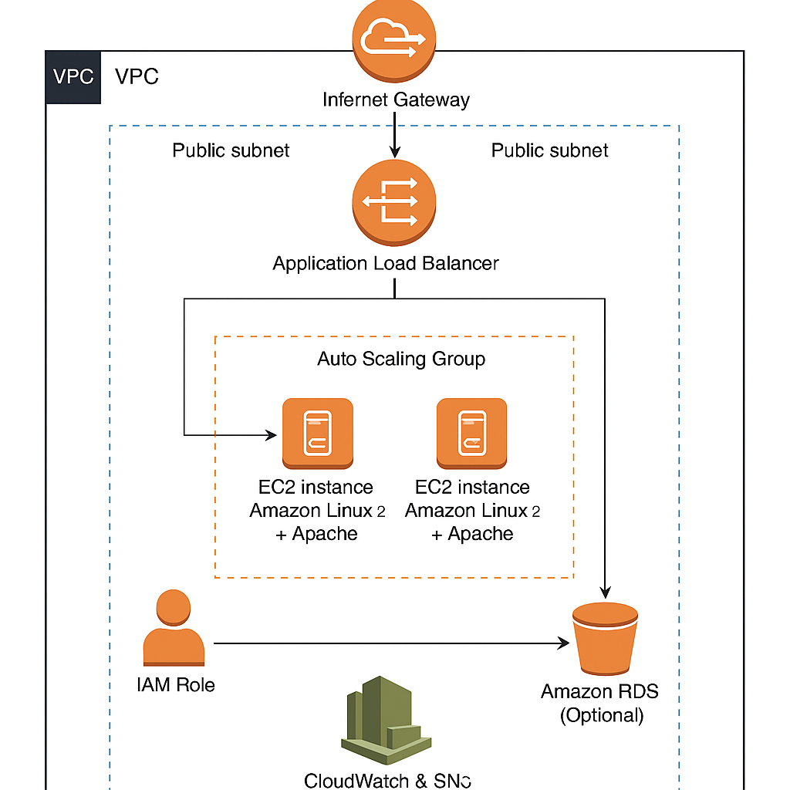

# Scalable Web Application on AWS

## Project Overview
This project demonstrates the deployment of a scalable and highly available web application on AWS using EC2 instances, Application Load Balancer (ALB), and Auto Scaling Groups (ASG). The architecture is designed to handle varying traffic loads by dynamically scaling compute resources while ensuring security and cost optimization.


my-alb-1848665182.ap-south-1.elb.amazonaws.com ( Application load balancer link )


---

## Solution Architecture Diagram



*Note: The architecture diagram visually represents how traffic is distributed by the ALB across multiple EC2 instances, the Auto Scaling policies, IAM roles for security, and monitoring via CloudWatch and SNS.*

---

## Architecture Details

- **EC2 Instances**: Host the web application. Instances are launched in multiple Availability Zones to ensure high availability.
- **Application Load Balancer (ALB)**: Acts as the single entry point, distributing incoming HTTP/HTTPS traffic evenly across EC2 instances, improving fault tolerance and performance.
- **Auto Scaling Group (ASG)**: Automatically adjusts the number of EC2 instances based on demand and predefined scaling policies, ensuring cost-effective resource utilization.
- **IAM Roles**: Securely assign permissions to EC2 instances, restricting access and enabling AWS services interaction.
- **CloudWatch & SNS**: Monitor application and infrastructure metrics, sending alerts for critical events to administrators for quick remediation.

---

## Key AWS Services Used

| Service                | Description                                                  |
|------------------------|--------------------------------------------------------------|
| **EC2**                | Virtual servers running the web application.                 |
| **Application Load Balancer (ALB)** | Distributes traffic across EC2 instances for scalability and fault tolerance. |
| **Auto Scaling Group (ASG)**       | Dynamically manages EC2 instance count based on demand.          |
| **IAM**                 | Manages secure role-based access for resources.             |
| **CloudWatch**          | Collects monitoring and operational data.                    |
| **SNS**                 | Sends notifications and alerts based on CloudWatch alarms.  |

---

## Features

- **High Availability**: Multi-AZ deployment for EC2 instances.
- **Scalability**: Auto Scaling adjusts resources dynamically.
- **Load Balancing**: ALB distributes traffic efficiently.
- **Security**: IAM roles enforce least privilege access.
- **Monitoring & Alerts**: CloudWatch and SNS integration for proactive management.

---

## How to Use / Deploy

1. **Clone the Repository**
   ```bash
   git clone https://github.com/ahmedbalushi2002/scalable-webapp-aws.git
   cd scalable-webapp-aws
